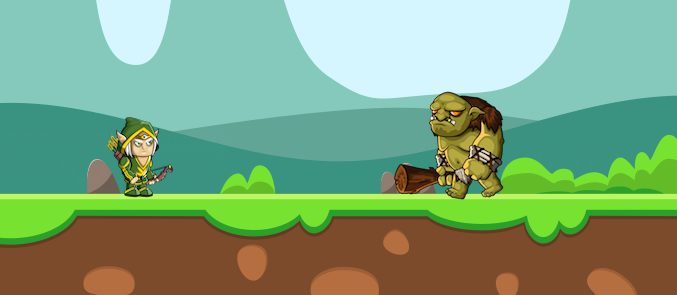

# Bowman

I would like to design and develop a game called Bowman which uses AI algorithms programs to be able to play more than one game successfully. For many games like chess, computers are programmed to play these games using a specially designed algorithm, which cannot be transferred to another context. For example, a chess-playing computer program cannot play checkers. A general game playing system, if well designed, would be able to help in other areas, such as in providing intelligence for search and rescue missions.

 

